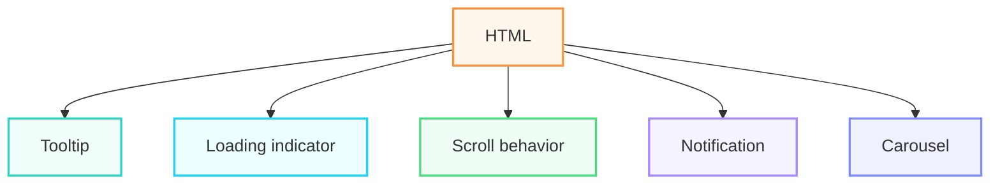
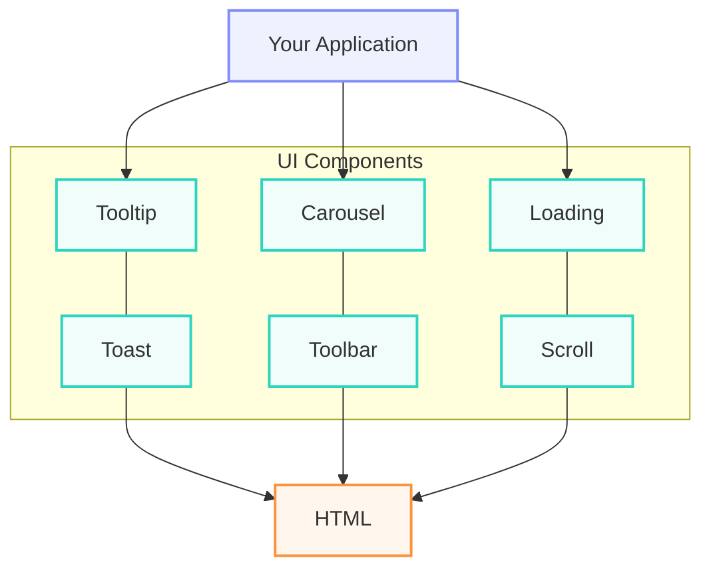
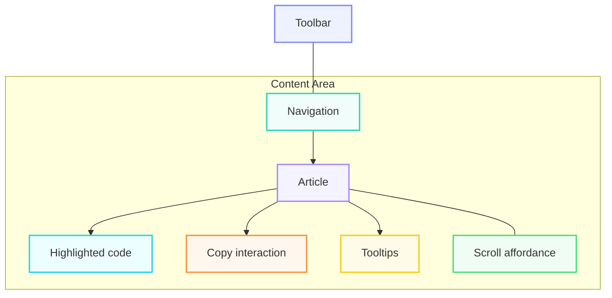
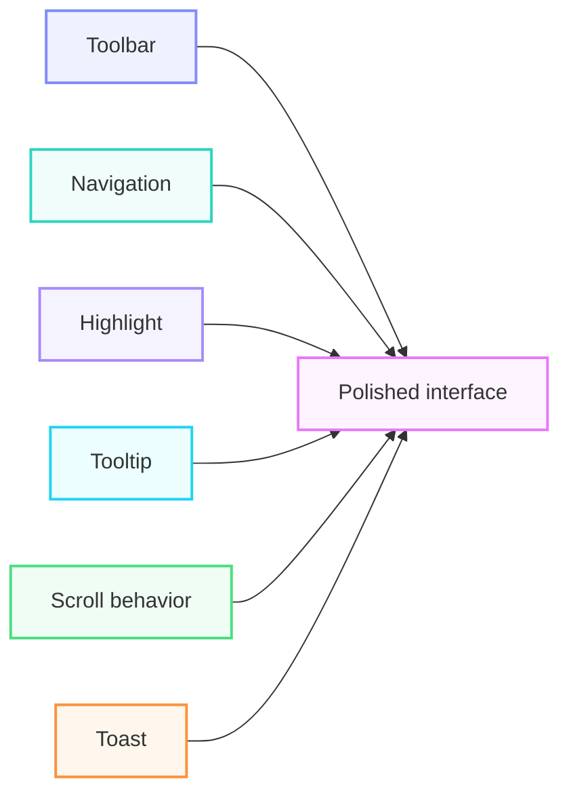

# Themestrap Philosophy

Themestrap began with a simple premise:

> Common interface behavior should be reusable without forcing a project into a build system, application framework, or large runtime.

A tooltip shouldn't require a compilation step. A loading indicator shouldn't require a bundler. A carousel shouldn't require your entire website to be rewritten as a JavaScript application.

Themestrap provides those pieces individually while still allowing them to work together.

## Why Themestrap?

Modern web development often assumes that every project should become an application.

Themestrap takes a different approach.

There are plenty of websites that don't need React, Vue, Angular, a bundler, or a complete application runtime. They may simply need a handful of interactive behaviors:



Themestrap lets you add those behaviors without turning the entire project into an application.

The result is **progressive enhancement without unnecessary infrastructure**.

## Component Philosophy

Themestrap components are intentionally focused.

A tooltip handles tooltips.

A carousel handles carousels.

A loading component handles loading states.

A navigation component handles navigation.

The component doesn't need to understand the application surrounding it.

This separation makes components easier to reuse and combine.



Each component owns its behavior while the application remains in control of the larger experience.

## Composing Components

The real value of Themestrap becomes apparent when components are combined.

Consider a documentation page:



No individual component owns the page.

Instead:



This is the central idea behind Themestrap.

> **The individual components may be small. Their ability to work together is what makes them useful.**

## Where Themestrap Fits

Themestrap is particularly well suited to:

* Static websites
* Marketing sites
* Documentation
* CMS templates
* Server-rendered applications
* Legacy applications
* Admin interfaces
* Prototypes
* Internal tools
* Websites that need selective JavaScript enhancement

It can also be used alongside an existing application architecture when a full component framework isn't appropriate for a particular page or feature.

## Dependencies

Most Themestrap components are self-contained and require only the core environment they were designed for.

Some components use third-party libraries for specialized functionality.

Examples include:

| Dependency                    | Components                     |
| ----------------------------- | ------------------------------ |
| `jquery.visible`              | Float Element, Icon            |
| `jquery.cookie`               | GDPR, GDPR Wrapper             |
| `Vivus`                       | Icon                           |
| `observe-element-in-viewport` | In-Viewport Style              |
| `vide`                        | Video Background               |
| `hover3d`                     | Hover Effect                   |
| `jquery.matchHeight`          | Match Height                   |
| `jquery.easing`               | Section Scroll, Scroll To Top  |
| `jquery.pin`                  | Sticky                         |
| `jquery-validation`           | Validation, Newsletter, Search |

The module loader can manage these dependencies when components are loaded dynamically.

## The Philosophy

Themestrap isn't trying to make every website into an application.

It's trying to make **small pieces of application behavior easy to reuse**.

A project should be able to start with:

```text
HTML
CSS
JavaScript
```

and selectively add:

```text
+ Tooltip
+ Carousel
+ Wizard
+ Before/After
+ Highlight
+ Loading
+ Navigation
+ Notifications
+ Animation
+ ...
```

without being forced to adopt everything else.

That means Themestrap can stay out of the way when it isn't needed and provide additional behavior when it is.

The goal isn't to make every component visible.

The goal is to make the interface feel intentional.

## Themestrap in One Sentence

> **A collection of focused, composable UI behaviors that can enhance an ordinary HTML page without turning it into a full application.**
